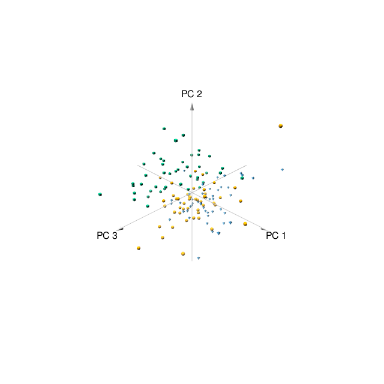
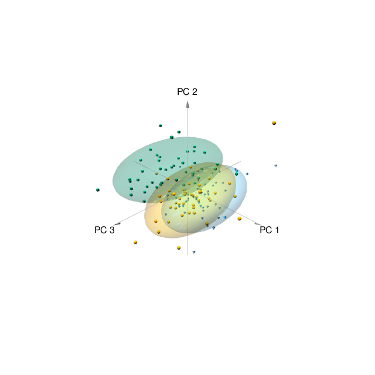

```{r setup, cache=FALSE, echo=FALSE, results="hide", include=FALSE}
library(knitr)
opts_chunk$set(cache=FALSE, autodep=FALSE, tidy=FALSE)
opts_knit$set(width=75)
knit_hooks$set(webgl = hook_webgl)
```

# Introduction

This package is actually a bunch of shortcuts to the RGL graphics library,
which does the actual job. The idea is to have a few functions that can be
quickly and reliably used to visualize and explore multivariate models, and
then create a publication-ready figure. By default, pca3d can handle
prcomp, princomp and matrix objects.

The provided data set, metabo, includes metabolic profiles for over 400
metabolites sampled from 136 tuberculosis (TB) patients and healthy
volunteers, and has been described previously [@weiner2012biomarkers]. The
samples fall into one of three groups: healthy, non-infected ("NEG"),
healthy infected ("POS") and individuals with active tuberculosis (TB).

First, we prepare the principal component analysis (PCA) object to work
with. The data is contained in the data frame "metabo"; first column of the
data set contains group assignments, and we need to remove it to work with
the rest of the data set:

```{r pca1}
library(pca3d)
data(metabo)
pca <- prcomp(metabo[,-1], scale.=TRUE)
gr  <- factor(metabo[,1])
summary(gr)
```

When `pca3d` is called, the opened window is interactive and can be used to
explore differences. Here, we call pca3d() and then save a screenshot
(snapshot) to a file.

```{r pca3d,results="hide"}
pca3d(pca, group=gr)
snapshotPCA3d(file="first_plot.png")
```



There is a two-dimensional version of `pca3d`, called (of course) `pca2d`.
Essentially, you can run exactly the same command, and you should see a
very similar output -- just 2D, and not 3D. The idea is that you can fiddle
around with the 3D version to explore your graphics and / or choose the
components, and then use `pca2d` to create a figure for a publication.

```{r pca2d,fig.width=5,fig.height=5,results="hide"}
pca2d(pca, group=gr, legend="topleft")
```

Both functions have several options for tweaking the visuals and adding
bells and whistles. 

# Plotting options

## Shapes, colors and palettes

The functions `pca3d` and `pca2d` try hard to guess the right values and
there are many ways to specify the colors and shapes. Colors and shapes can
be specified as follows:

 * a single value; in that case, all drawn data points will have this
   associated value (e.g. the same color)
 * a vector equal to the number of samples, specifying color / shape for
   each data point separately
 * a named vector equal in length to the number of levels of the `group`
    option, that is, equal to the number of groups present in the data. In
    this case, the names of the vector must correspond to the levels of
    `group`.
 * If color or shape are not specified, but `group` is not `NULL`, then
   shapes and colors will be attributed automatically to groups 

### Shapes / pch

Currently, there are four possible 3D shapes to choose from: tetrahedrons, cubes, 
spheres and octahedrons. The corresponding 2D pch values are 17, 15, 16 and
18, respectively. You can get the list of permissible shapes and their pch
counterparts using the `listShapes` function.

```{r}
listShapes()
```

The shapes for 3D plots should be specified using these character
values, or with an abbreviation (e.g. `t` for `tetrahedrons`).

For 2D plots, shapes can be specified using any valid numeric values of the
`pch` parameter. However, shapes defined by their 3D names (tetrahedrons
etc.) are also permissible. 

### Shape sizes

The parameter "radius" scales the symbols (much like `cex` for regular
plots, or rather, exactly like `cex` for pca2d).

### Colors and palettes

For 3D plots, colors and palette should not contain an alpha channel; that
is, `#FF0000` is permisible, but `#FF000033` not. 

Palette is a character vector with color names. A default,
colorblind-friendly palette is predefined in the package (see the
`defaultPalettePCA3D` function).


## Ellipses / ellipsoids (option `show.ellipses`)

These option show a confidence interval (CI) ellipse (2D) or ellipsoid
(3D). The option ellipse.ci corresponds to the level for which the CI is
supposed to be drawn (default 0.95). A less conservative level (e.g. 0.75)
will result in a morre narrow ellipse. For the 3D representation, it is
worthwile to remove the grey plane at z=0 with the `show.plane=FALSE` option.

```{r ellipse1,results="hide"}
pca3d(pca, group=gr, show.ellipses=TRUE,
  ellipse.ci=0.75, show.plane=FALSE)
snapshotPCA3d(file="ellipses.png")
```



## Biplots

A biplot shows information on variable loadings, which helps to interpret
a PCA. To see a biplot, use the `biplot` parameter. If `TRUE`, then
variable loadings will be extracted from the princomp or prcomp object. If
`biplot` is a matrix, then it is assumed to be a matrix of variable
loadings.

The second option is `biplot.vars`, which describes how many variables are
shown on the plot. The top N variables are selected based on their absolute
loadings.

```{r fig.width=5,fig.height=5}
pca2d(pca, group=gr, biplot=TRUE, biplot.vars=3)
```


## Shadows (lollipops), centroids, labels, group labels

The options show.shadows, show.centroids, show.labels and show.group.labels
determine about adding additional graphical information. You can set them
all to "TRUE" with the `fancy=TRUE` option -- mostly for demonstration
purposes, because the plot is then hardly readable.

 * **`show.shadows`** Draw a thin grey line from the point to the xy plane
 * **`show.centroids`** Show a large symbol of the group at the average
   coordinates of samples in that group (centroids)
 * **`show.labels`** Show text labels at each point
 * **`show.group.labels`** Show group labels at the centroids

```{r fancy,results="hide",warning=FALSE}
pca3d(pca, group=gr, fancy=TRUE)
snapshotPCA3d(file="fancy.png")
```


## Legends

Both `pca3d` and `pca2d` will produce a legend if the option `legend` is
not `NULL`.  The argument to this option is anything acceptable by
`xy.coords`. Typically, you will want something like "`topleft`" or
"`bottomright`".

```{r fig.height=6,fig.width=6}
pca2d(pca, group=gr, legend="bottomleft")
```

## Return value

Both `pca2d` and `pca3d` return a data frame containing the assignments
between groups, colors and shapes that can be used to plot a legend. Since
shapes are character vectors, additionally a mapping to the 2D plotting
"pch" parameter is provided. This can be used to draw a legend (however, it
is more convenient to specify the `legend` option).

```{r fig.width=6,fig.height=6}
l <- pca2d(pca, group=gr)
l
legend("topleft", l$groups, col=l$colors, pch=l$pch, box.lty=0)
```


# References

